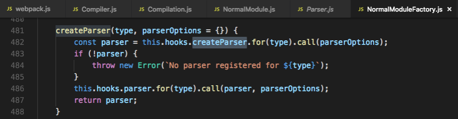
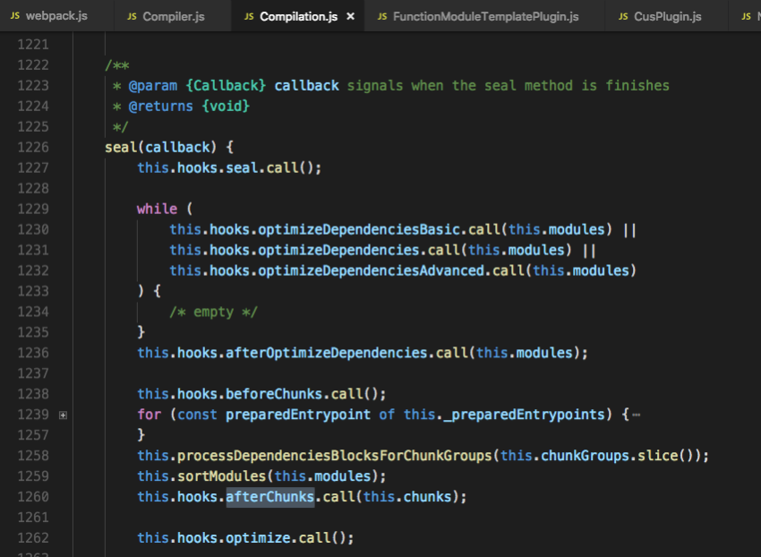
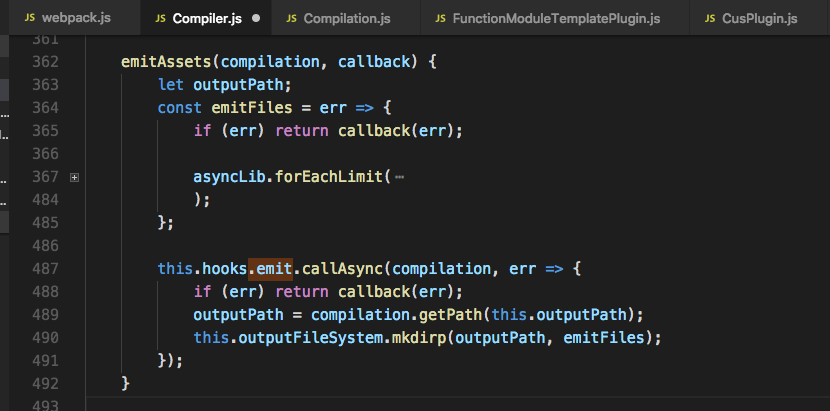

# webpack构建流程

webpack本质其实就是一个工具，是当今最流行的打包工具，没有之一，但同时也被广大群众吐槽，原因就是，配置困难。一个项目如果把webpack拿来即用还好，他封装了很多默认配置项，倘若要做一些自定义的配置，完了，这个时候即便是官方文档也显得很鸡肋，当你吭哧吭哧地改完了看似正确地配置后，估计项目也临近deadline了。

怎么办，有两个办法：

  1. 通读文档，记住每一个配置项了解其意义；
  1. 了解其内部运行原理；

然而，然而...

如果把webpack比喻成一棵树的话，那将是一棵非常非常枝繁叶茂的大树。他不仅自身提供了很多配置项，其生态系统又有几十上百个plugin和loader，每一个插件和loader又有几十个API，如果条分缕析地去深究每一项，甚至通读文档，是很不现实的，因此我们采取方案b。但是不要奢望这一篇文档就能让你对webpack的运行机制清晰透彻的认识，本文也只是根据我自己的理解，根据几个webpack的重要动作节点，提炼了一个大致的画像，帮助我们理解。

从输入webpack的配置到输出bundles文件，总共分几步，三步，倘若类比炒菜，就是：
第一步、准备物料，放锅里，添点儿油加点儿盐；
第二步、是焖是煮是蒸是炸，看情况决定这一步是否要重复，最终做成啥样儿，就看这一步的造化；
第三步、出锅装盘；
对，就是这么简单，但是，做菜真的其实不简单，webpakc也一样，其中的每一个点，都能牵出一条线，每一条线，又能牵出一个面。

具体到webpack这里：
第一步、通过webpack-cli读取配置，并添加了一系列的默认配置项(不看源码，你永远不知道webpack偷摸地做了哪些小动作)；
第二步、modules和chunks生成阶段；
第三步、bundle文件落成；
（webpack版本为4.29.6，开始了解webpack内部运行机制之前，建议先简单了解下Tapable库，因为webpack是由插件构成的，而几乎每一个插件都继承自Tapable，是基于Tapable搭建、串联起来的）

**一、准备阶段**
**

1. **进入入口文件（****./node_modules/.bin/webpack****）**
  1. 功能：
    1. 检查你有没有装webpack-cli，如果没有，提示你去装，并退出进程，如果有，执行webpack-cli命令。
  2. 技能点：
    1. 判断采用的哪种包管理器，可以根据本地是否有yarn.lock文件，有的话就是yarn，没有的话就是npm；
    1. 判断是否装了某个包，可以通过require.resolve(packageName)尝试引入这个包，如果没报错，就说明已经安装了；
2. **执行webpack-cli命令（****./node_modules/.bin/webpack-cli****）**
  1. 功能：
    1. 通过正则匹配找到本地的webpack配置文件，读取配置（./webpack-cli/bin/convert-argv.js）,并实例化自定义插件；
    1. 引入webpack下的Schema模块，这个工具可以根据提供的json文件（./webpack-cli/bin/optionsSchema.json），对目标对象（读取到的配置对象）进行校验，若不符合规范，就提示相应的报错；
    1. 重点功能在./webpack-cli/bin/cli.js文件，引入webpakc模块并传入配置对象，得到compiler对象后，调用他的run或watch方法，开启了webpack构建的征程；
  2. 技能点：
    1. Ajv模块，将我们定义的Schema模式作为参数生成一个对象，使用这个对象的构造函数可以检测数据的合法性，适合规模较大的项目，具体使用案例可参考webpack的使用（./webpack/lib/validateSchema.js）；
    1. webpack-cli的代码严格遵循模块化设计，当我们自己要实现一个工具时，既要严格校验用户的输入参数，又要高度灵活地支持各种类型的配置，同时要有友好的报错提示，webpack-cli是个值得参考的例子；
3. **webpack构建的起点（****./node_modules/.bin/webpack-cli****）**
  1. 功能：
    1. 对输入的配置再次进行校验；
    1. 通过WebpackOptionsDefaulter插件添加默认配置项；
    1. 实例化compiler；
    1. 实例化WebpackOptionsApply插件，这个插件根据不同的配置项，统一配置项的不同类型，初始化不同的内部插件，调用这些插件的apply方法，每个插件内部都会监听compiler上的钩子节点，去执行相应的逻辑。
    1. 至此，经过一系列的解析和加工，options配置完成了，compiler上的run或watch方法，真正执行的节点是在这个时候；
    1. compiler.run 方法里边，另一个主角Compilation登场了，调用compiler.compile方法和初始化compilation传入的对象是同一个，有两个属性：normalModuleFactory、contextModuleFactory；

这个准备阶段涉及到的插件，已经妥妥地超过了100个了，而这些，只是冰山一角，而才仅仅完成了准备工作。

**二、modules和chunks生成阶段**

该阶段的主要任务是解析项目依赖的所有modules（包括：创建实例、loaders应用、依赖收集），再根据modules生成chunks（找到chunks依赖的modules）。

1. **addEntry**
  1. compiler在初始化Compilation之后，立即触发了make钩子的调用，使得SingleEntryPlugin或MultiEntryPlugin或DynamicEntryPLugin插件上挂载在make钩子上的逻辑被执行，这里的逻辑主要调用了compilation.addEntry方法；
  1. addEntry方法触发了对entry配置模块的解析
2. **module的解析过程**
  1. 涉及两个比较重要的工厂方法：normalModuleFactory、contextModuleFactory，这个在准备阶段有提到过。normalModuleFactory用来创建NormalModule实例，这个工厂方法主要是解析module需要用到的一些属性，如需要用到的loaders、需要用到的resources等；
  1. NormalModule实例创建完成之后，build.module方法（./webpack/lib/Compilation.js）里会调用module.build方法进行内部构建，NormalModule实例内部记录了需要用到的loaders，通过直接调用第三方模块loader-runner去应用loader，然后在build方法（./webpack/lib/NormalModule.js）里，将loader处理后的module源码传给parser，这个parser是在工厂函数里边创建的，底层的Parser插件使用的是acorn（一个小型的JS解析器），他将JS代码解析成AST（抽象语法树）并返回；

  1. webpack拿到AST之后，就开始收集依赖了，webpack会遍历AST语法树，按照一定的规则触发钩子函数，由于webpack要兼容不同的依赖方式，这个地方的逻辑非常复杂，我们不做深究；
  1. module解析完成之后，会递归地调用他所依赖地modules进行解析，直到解析完所有地依赖modules，他们将被存储在Compilation的modules属性中，此时make钩子结束；
  1. make钩子执行完之后，立即执行seal钩子，seal方法里边，利用拿到所有的modules之后，webpack开始生成chunk，每个chunk的生成就是找到需要包含的modules。
    1. webpack先将entry对应的module生成一个chunk；
    1. 获取依赖的module，也加入到chunk中；
    1. 若一个依赖的module是动态引入的，就会新创建一个chunk，继续遍历依赖；
    1. 重复上边的步骤，直到得到所有的chunks；

  6. chunks生成之后，webpack还会做一些优化动作，比如分配id、排序等，并会触发一些钩子，比如CommonsChunkPlugin插件会在optimize-chunks钩子上挂载一些处理逻辑，钩子被触发式就会执行相应的逻辑；

**三、文件生成阶段**

该阶段主要是根据chunks生成文件，主要有三个步骤：模板hash更新、模板渲染chunk、生成文件。

1. 实例化Compilation时，会初始化三个对象：
  1. MainTemplate：entry配置的入口module生成的chunk的渲染模版；
  1. ChunkTamplate：动态引入的非入口chunk的渲染模板（与MainTemplate不同在于，入口chunk代码中会带有启动webpack的代码）；
  1. ModuleTemplate：chunk中包含的modules的渲染模板；
2. 调用createHash方法（./webpack/lib/Compilation.js），创建hash，我们看到的chunks文件名也来源于此；
2. 最终会构建一个assets对象，里边存放着文件列表，包括每个文件的内容以及文件大小数据，至此，seal方法执行完毕；
2. seal方法之后，触发compiler上的afterCompile钩子，这个钩子里边会调用emitAssets方法，并触发compiler的最后一个钩子emit，遍历compilation.assets（./webpack/lib/Compilation.js）将所有的chunks文件写入到制定路径下，然后触发done（./webpack-cli/lib/cli.js）；

至此，webpack的基本构建流程已经结束，这只是对webpack有个概览，因此还还要对他做一些深入与补充。

（文章大部分内容是以文件为纬度展开的，因此更适合就这源码看。如果文章不够生动形象，看完之后还是一头雾水，或者看的发困，欢迎吐槽；文章有误，欢迎指正；你有更好的建议，欢迎留言～）

